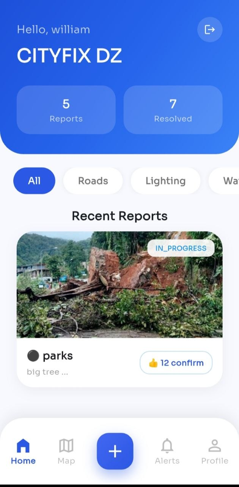
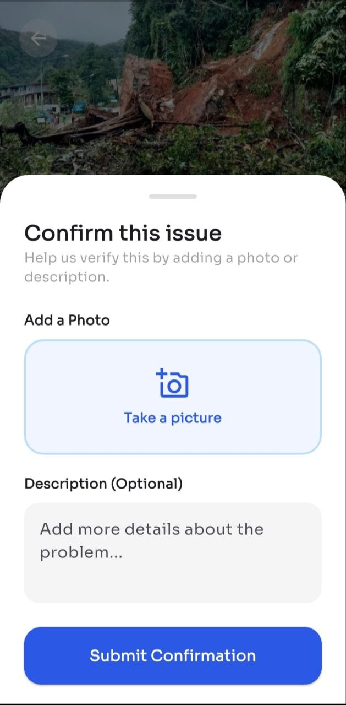
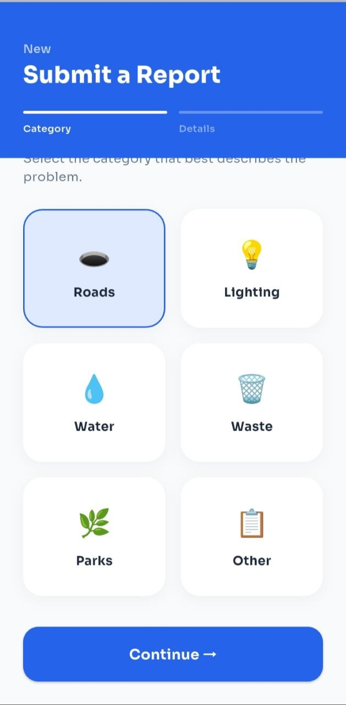
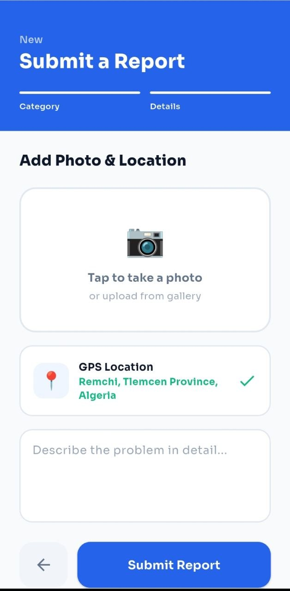
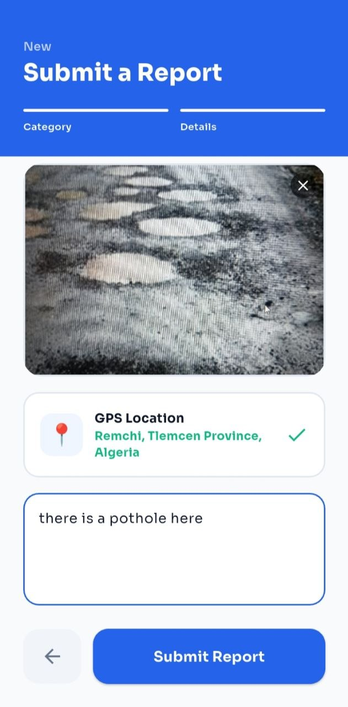
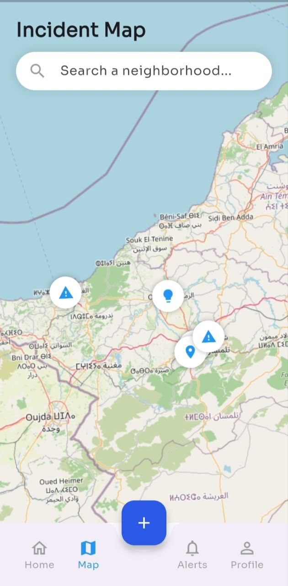
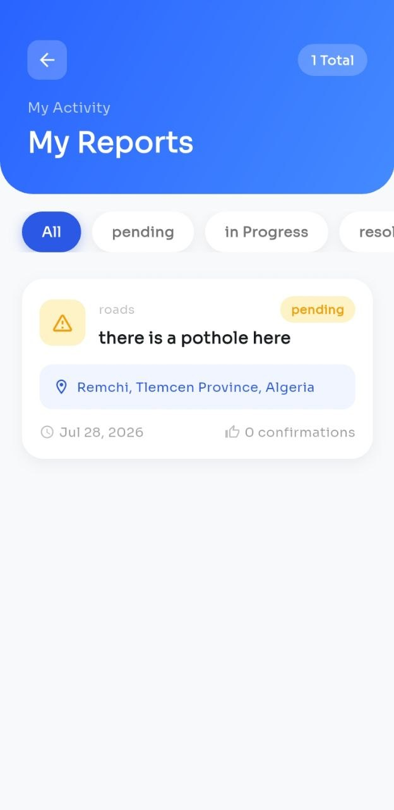

# CityFix
CityFix is a Flutter mobile application developed as a university graduation project. It allows citizens to report, confirm, and track urban issues such as potholes, broken streetlights, and waste management problems, while providing administrators with tools to manage and resolve reports.

## Features
- user can submit new report
- user can confirm an existing report (submitted by other users)
- user can see existing reports on the map
- user can see their own submitted reports in the profile
- users will be notified when someone confirms their report or someone nearby them submits a report

## Tech Stack
- Flutter (Dart)
- Firebase (Auth, Firestore)
- Cloudinary (image storage)
- OpenStreetMap / Geolocator

### Prerequisites
- Flutter SDK >= 3.38.9 
- Firebase project configured

## License
This project is provided for portfolio and demonstration purposes only.
No part of this source code may be copied, modified, or redistributed without explicit permission from the authors.

## Screenshots 

<h3> Home</h3>

<h3> Confirm a Report</h3>

<h3>Submit a Report</h3>

  
  
  

<h3> Map </h3>

<h3> User's reports </h3>

